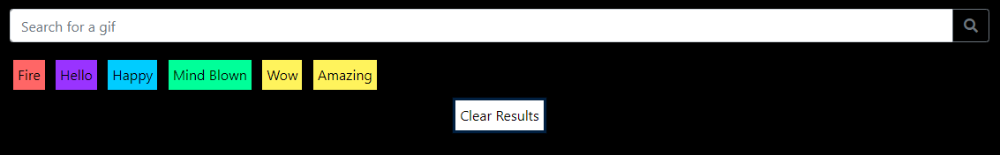

# GIF Search
## Search for your favorite GIFs using the Giphy API

When you load up the page you will see a search bar with some buttons pre loaded.

Type in your search term and 24 Gifs related to that term will populate the page. You will also notice that a new button is added that contains your search term! 

The GIFs will load still, to animate them all you have to do is click them!

When you search for a new term the new results will load at the top of the list and push the older ones to the bottom.

You can clear the list by clicking the "Clear Results" button.

You can also search for GIFs by clicking on a button containing a search term!

